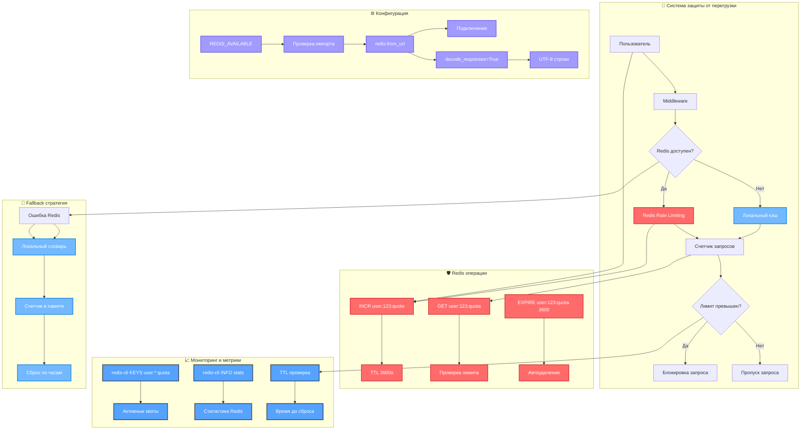
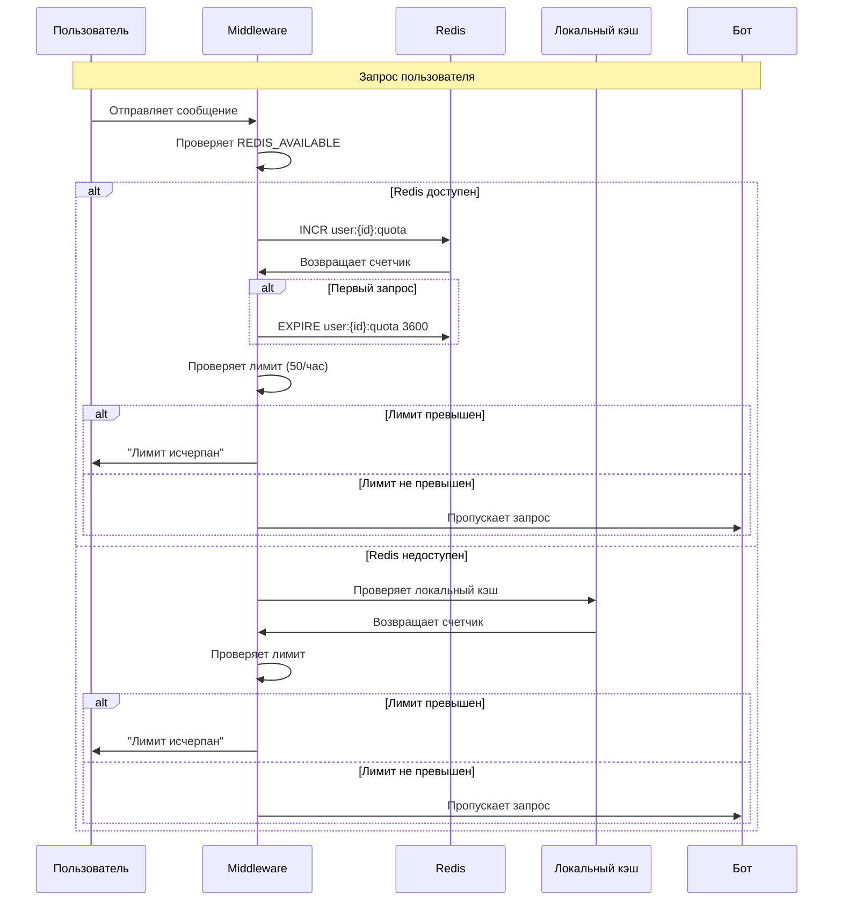
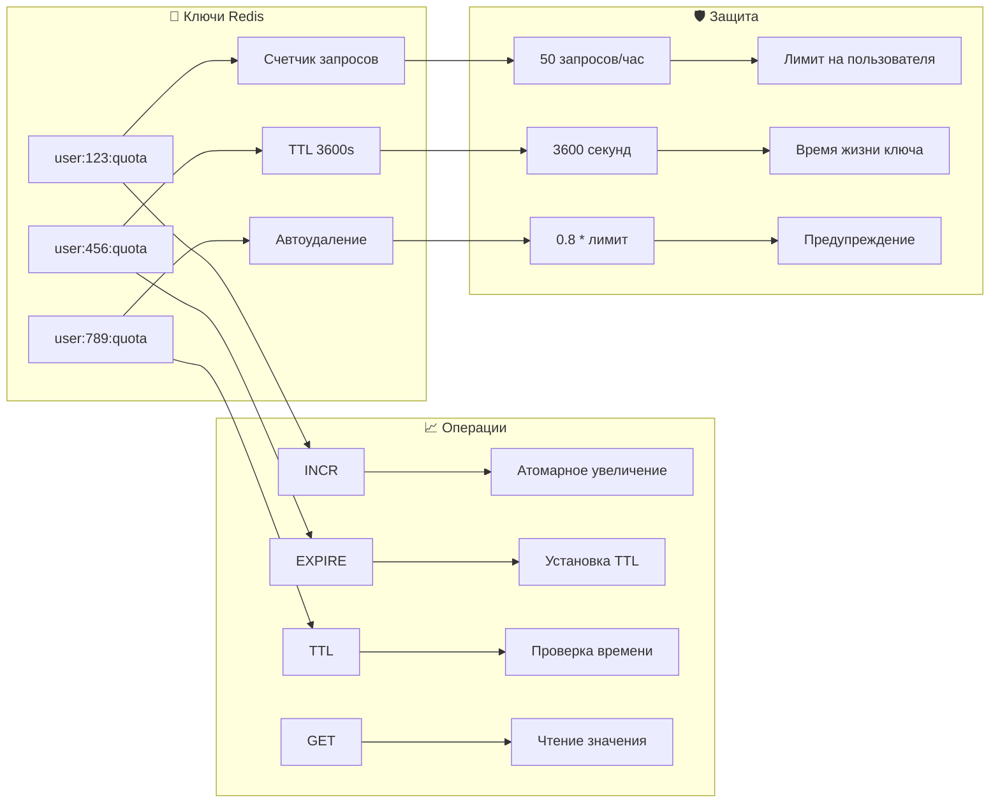
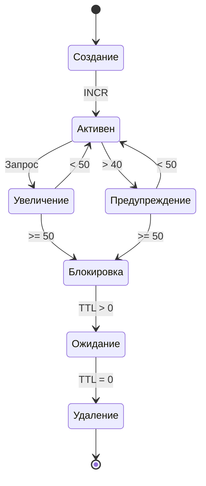
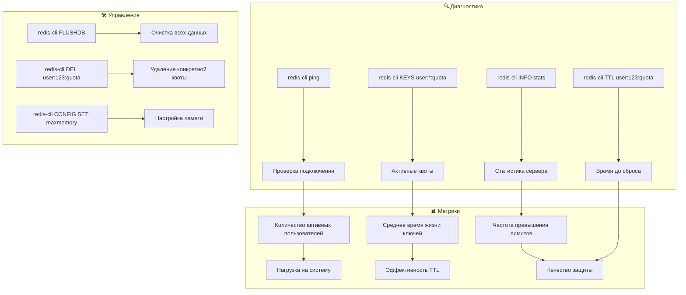

# 🔴 Полное использование Redis в проекте TechnoBot

## 📊 Архитектура Redis в проекте



## 🔧 Детальная схема работы Redis



## 📊 Структура данных Redis



## 🔄 Жизненный цикл Redis ключа



## 📋 Команды мониторинга



## 🎯 Интеграция с ботом

```mermaid
graph TB
    subgraph "🤖 Основной бот"
        A[bot.py] --> B[Импорт redis.asyncio]
        B --> C[REDIS_AVAILABLE проверка]
        C --> D[Middleware инициализация]
    end

    subgraph "🛡️ Middleware"
        E[HourlyLimitMiddleware] --> F[Проверка лимитов]
        F --> G[Redis операции]
        G --> H[Fallback логика]
    end

    subgraph "📊 Команды"
        I[/test_limits] --> J[Проверка статуса]
        J --> K[Redis диагностика]
        K --> L[Отображение метрик]
    end

    subgraph "🔧 Конфигурация"
        M[requirements.txt] --> N[redis>=5]
        O[run_improvements.sh] --> P[Установка Redis]
        Q[FIX_PYTHON_313.md] --> R[Совместимость]
    end

    A --> E
    E --> I
    I --> M
    M --> O
    O --> Q
```

## 📝 Резюме использования Redis

### ✅ **Что использует Redis:**
- **Rate Limiting** - ограничение запросов пользователей
- **Распределенное хранение** - для нескольких экземпляров бота
- **Автоматический TTL** - самоочистка старых данных
- **Атомарные операции** - безопасное увеличение счетчиков

### ❌ **Что НЕ использует Redis:**
- **Очереди операторов** - реализованы в памяти
- **Кэширование RAG** - используется ChromaDB
- **Сессии пользователей** - хранятся в FSM
- **История сообщений** - локальное хранение

### 🔧 **Ключевые особенности:**
- **Graceful degradation** - fallback на локальный кэш
- **Совместимость с Python 3.13** - безопасные импорты
- **Мониторинг** - команды для диагностики
- **Настраиваемые лимиты** - 50 запросов/час на пользователя 